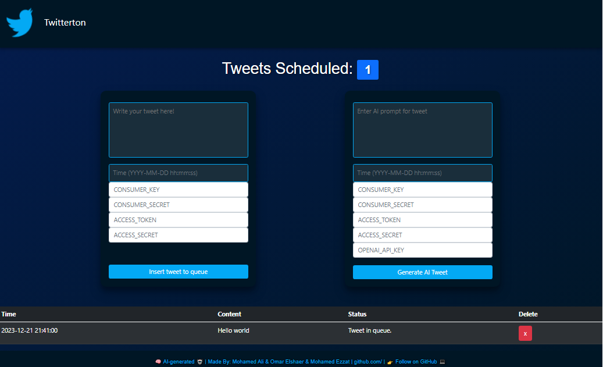

# Twitterton
A Flask-based web application that allows users to write tweets and schedule them or use Ai to write the tweets for them. The app utilizes the Tweepy library for tweeting and OpenAI for creating the tweets. It provides a user-friendly interface for creating and managing tweet schedules.

## Features
- **Schedule Tweets**: Create and schedule tweets to be posted at specific dates and times.
- **Tweet Management**: View and delete scheduled tweets.
- **Automatic Tweet Posting**: A worker script (`tweet.py`) continuously runs in the background, checking the scheduled tweets, and automatically posts them at the specified times.
- **AI functionality**: Automatically creates tweets from your prompt.

## Getting Started
To use the Tweet Scheduler Web App, follow these steps:

1. Clone this repository to your local machine.
2. Install the required dependencies by running the following command:
   ```bash
   pip install -r requirements.txt
3. Set up your Database.
4. Run the Flask app and the worker script:
   ```bash
   python -m app.main
5. Start the worker script (`tweet.py`):
   ```bash
   python tweet.py


## Customizing

You can customize the prompts that are used to generate the Tweets. Under the prompts folder you will find the following file:
- `concept.txt` - This file contains the prompt that is used to generate the Tweet.

## License

This project is licensed under the MIT License. See the [LICENSE](LICENSE) file for more information.
